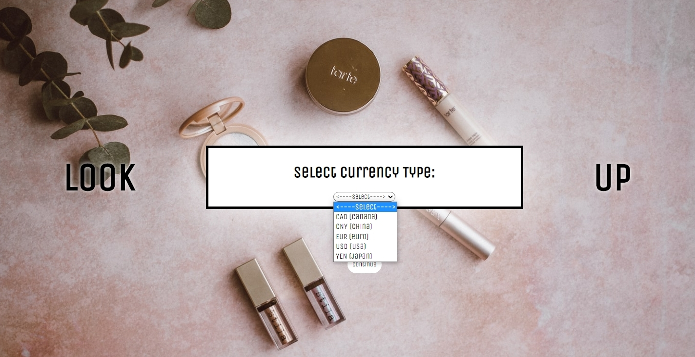

# Look Up
A web application for users who want to search for makeup and know what the price of
that product is at their desired exchange rate.

## Live Link

## Technologies Used
+ HTML 5
+ JavaScript (ES6)
+ CSS 3
+ jQuery AJAX
+ REST APIs

## Features
+ User can search by exchange rate
+ User can search by either the name of a product, brand, or by tag
+ User can select a price range
+ User can view a list of products returned from their search

## Preview


## Getting Started
1. Clone the repo and navigate to the directory
```
git clone https://github.com/Victoria-Corona/look-up
```
2. Navtigate to the directory
```
cd look-up
```
3. Run the application from `index.html` in the code editor
